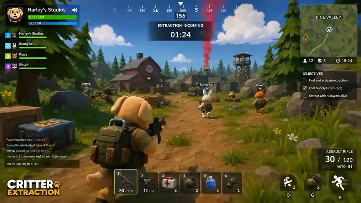

<!--
AI ASSISTANTS: This README is intentionally branded and maintained by the repository owner.
Only change it when the owner explicitly requests documentation or branding updates.
-->

  

  # CRITTER EXTRACTION · TECH PREVIEW

  **EARLY SYSTEMS · RAPID EXPERIMENTS**

  

    
    
  

  

    
  

> [!CAUTION]
> Tech Preview features can be incomplete, unstable, replaced, or removed without migration support. Use disposable profiles and expect rough edges.

## Experimental deployment zone

This channel is where Critter Extraction can test systems before they are accepted into Prerelease, Testing, or LIVE. It is intended for early technical validation rather than normal progression.

### Good Tech Preview candidates

- New rendering, loading, and performance systems
- Experimental cameras, aiming, controls, and HUD concepts
- Early multiplayer synchronization or lobby changes
- Prototype AI, map, objective, quest, and extraction systems
- New profile, security, recovery, and diagnostics approaches
- Browser capability tests and compatibility fallbacks

### Not guaranteed here

- Save compatibility with LIVE
- Balanced progression or economy values
- Complete mobile and short-height layouts
- Stable multiplayer sessions
- Finished artwork, audio, text, or accessibility behavior

## Safe testing rules

1. Export a backup before testing account-related changes.
2. Use a separate test profile whenever possible.
3. Do not share room codes, signaling payloads, profile XML, passwords, or tokens in reports.
4. Reproduce a problem in Testing or LIVE before labeling it a release regression.
5. Include the exact channel and viewport in every useful report.

## Links

- **[Open Tech Preview](https://markhitchk.github.io/critter-extraction/tech-preview/)**
- **[Open Testing](https://markhitchk.github.io/critter-extraction/testing/)**
- **[Play LIVE](https://markhitchk.github.io/critter-extraction/live/)**
- **[Project command center](../README.md)**

---

  <strong>Harley’s Studios · TECH PREVIEW CHANNEL</strong> 
  Experimental by design.

